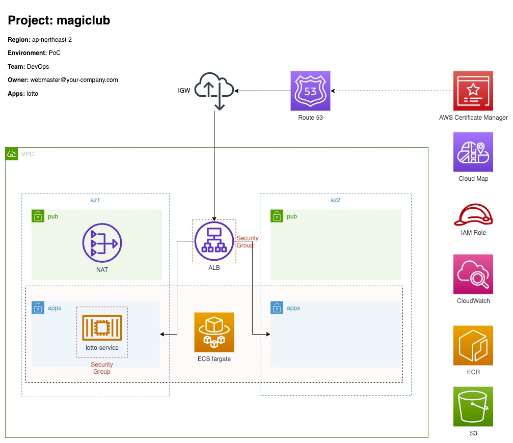

# aws-fargate-magiclub

이 프로젝트는 Terraform 모듈을 사용하여 AWS ECS 서비스 및 여기에 관련된 AWS 리소스들과 샘플 애플리케이션 서비스를 한 번에 프로비저닝하는 데모 입니다.

AWS 클라우드를 활용하여 고객이 필요로 하는 애플리케이션 서비스를 DevOps 체계로 보다 빠르게 배포 하고 고객 피드백을 확인 할 수 있습니다.   

## Architecture



### 주요 리소스 개요

- Route 53: 인터넷 사용자가 도메인 이름을 통해 서비스에 접근 합니다.
- VPC: 컴퓨팅 리소스를 배치하는 공간으로 네트워크 구성 및 네트워크 연결 리소스로 서로 통합 되어 있습니다.
- ALB: Route 53 으로부터 유입되는 트래픽을 요청에 대응하는 애플리케이션 서비스로 라우팅 합니다.
- ECS Fargate: 클러스터, 작업 정의, 서비스로 생성된 컨테이너 기반 애플리케이션 서비스를 제공 하는 컨테이너 서비스 입니다.
- ECS Task Definition: lotto 애플리케이션을 위한 작업 정의 입니다.
- ECS Service: lotto 애플리케이션을 위한 ECS 서비스 입니다.
- ECR: 컨테이너 (도커) 이미지를 등록 관리하는 레지스트리 서비스로 작업 정의에서 설정 됩니다.
- CloudWatch: ECS 애플리케이션 서비스의 로그를 수집 관리하는 로거 드라이브로 작업 정의를 통해 구성 합니다.
- IAM Role: 태스크를 정의하는 Role과 ECS 서비스를 실행하는 Role 을 작업 정의에서 설정 됩니다.
- Cloud Map: 컨테이너 애플리케이션을 위한 디스커버리 서비스로 Route 53 의 호스팅 정보가 사전에 구성되어 있어야 합니다.

## Pre-requisite

AWS ECS Fargate 서비스를 프로비저닝 하기 위해 다음의 Tool 들을 설치 해야 합니다.  
특히, Domain 서비스와 KMS 비대칭키를 사전에 구성 되어 있어야 하며, Docker 이미지를 빌드 할 수 있도록 Docker Daemon 이 구동되어 있어야 합니다.

- [Terraform 설치](https://learn.hashicorp.com/tutorials/terraform/install-cli)
- [AWS CLI 설치](https://docs.aws.amazon.com/ko_kr/cli/latest/userguide/getting-started-install.html)
- [AWS Profile 구성](https://docs.aws.amazon.com/ko_kr/cli/latest/userguide/cli-configure-files.html)
- [Docker 설치](https://docs.docker.com/desktop/mac/install/)
- [AWS KMS 비대칭키 생성](https://docs.aws.amazon.com/ko_kr/kms/latest/developerguide/asymm-create-key.html)

참고로 다음 블로그를 참고 하면 로컬 개발 환경 및 Domain 서비스 가입을 편리하게 할 수 있습니다.

- [Mac OS 개발자를 위한 로컬 개발 환경 구성](https://symplesims.github.io/development/setup/macos/2021/12/02/setup-development-environment-on-macos.html)
  가이드 참고
- [AWS Route53 도메인 서비스 관리](https://symplesims.github.io/devops/route53/acm/hosting/2022/04/09/aws-route53.html) 가이드 참고

## Git

`aws-fargate-magiclub` 프로젝트를 내려 받습니다. 
```
git clone https://github.com/chiwoo-cloud-native/aws-fargate-magiclub.git
```

## Build

`aws-fargate-magiclub` 프로젝트 경로에서 `sh deploy.sh` 명령을 통해 AWS 클라우드 리소스 및 ECS Service(애플리케이션)가 한번에 프로비저닝 됩니다.

```
cd aws-fargate-magiclub

sh deploy.sh
```

## Check Service

프로비저닝이 완료 되면 cURL 명령을 통해 샘플 애플리케이션(lotto) 이 실제로 동작하는지 확인 할 수 있습니다.

### Check Application Health 

도메인을 `sympledemo.tk` 으로 설정 하였다면 `https://lotto.sympledemo.tk` 으로 서비스 앤드포인트로 액세스 할 수 있습니다.

```
curl --location -X GET 'https://lotto.sympledemo.tk/health'
```

### Check Application Feature 

```
curl --location -X GET 'https://lotto.sympledemo.tk/api/lotto/lucky' -H 'Content-Type: application/json'
```

### AWS CloudWatch 로그 그룹의 로그 확인

```
aws logs tail /ecs/magiclub-an2p-ecs-lotto --since 1s --follow

-------------
2022-07-06T08:49:07.117000+00:00 magiclub-an2p-ecs-lotto/magiclub-an2p-ecs-lotto/8da960d491c0453aa90c3b9f39504d2a 2022-07-06 08:49:07.116  INFO 8 --- [or-http-epoll-4] ttoRouterFunction$LottoHandler$Companion : result: [2, 5, 22, 25, 32, 38]
2022-07-06T08:49:08.562000+00:00 magiclub-an2p-ecs-lotto/magiclub-an2p-ecs-lotto/8da960d491c0453aa90c3b9f39504d2a 2022-07-06 08:49:08.560  INFO 8 --- [or-http-epoll-4] ttoRouterFunction$LottoHandler$Companion : result: [13, 21, 32, 33, 39, 45]
```

## Destroy

아래 명령을 통해 ECS Fargate 관련 클라우드 리소스 및 lotto 애플리케이션이 한번에 제거 합니다.

```
sh destroy.sh
```

## Appendix

### Docker 호스트 확인

애플리케이션 컨테이너 이미지 빌드를 위해 도커 이미지를 빌드 할 수
있는 [Docker Terraform 프로바이더](https://registry.terraform.io/providers/kreuzwerker/docker/latest) 를 추가 하였습니다.

- [providers.tf](./services/lotto/providers.tf)

```
terraform {
  required_providers {
    docker = {
      source  = "kreuzwerker/docker"
      version = "= 2.16.0"
    }
  }
}

provider "docker" {
  host = "unix:///var/run/docker.sock"
}
```

위의 설정 파일에서 docker host 는 사용자마다 다를 수 있습니다. 먼저 docker 데몬이 구동 되어 있어야 하며, docker context ls 를 통해 현재 docker 앤드포인트가 무엇인지
DOCKER ENDPOINT 값을 확인하세요.  
그리고 provider "docker" 리소스의 host 속성 값을, 현재 사용중인 ENDPOINT 로 설정 합니다.

```
docker context ls

NAME        DESCRIPTION                               DOCKER ENDPOINT                        KUBERNETES ENDPOINT   ORCHESTRATOR
default *   Current DOCKER_HOST based configuration   unix:///var/run/docker.sock                                  swarm
```

DOCKER_HOST 환경 변수를 설정하면 docker CLI 로 액세스할 docker 컨텍스트를 지정 할 수 있습니다.

```
export DOCKER_HOST="unix:///var/run/docker.sock" 
```

## Terraform

aws-fargate-magiclub 프로비저닝을 위한 Terraform 주요 정보를 참고 하세요.

### Requirements

| Name      | Version     |
|-----------|-------------|
| terraform | >= 1.0.0    |
| aws       | >= 3.75.1   |
| docker    | >= 20.10.1  |

### Providers

| Name               | Version   |
|--------------------|-----------|
| hashicorp/aws      | >= 3.75.1 |
| kreuzwerker/docker | = 2.16.0  |

### Modules

| Name                      | Version | Provider |
|---------------------------|:-------:|:--------:|
| terraform-aws-modules/vpc | latest  |   AWS    |
| terraform-aws-modules/alb | latest  |   AWS    |
| terraform-aws-modules/ecs |  3.5.0  |   AWS    |
| ecs-service               |   N/A   |  Local   |

### Inputs

| Name            | Description                                           |  Type  | 
|-----------------|:------------------------------------------------------|:------:|
| project         | 프로젝트 코드로 약어로 8자 이내로 입력하세요                     | string |
| region          | AWS Region 코드 입니다. ap-northeast-2 인 경우 an2 입니다.  | string |
| environment     | Production / Development 와 같은 운영 환경 입니다.          | string |
| env             | environment 값의 별칭으로 첫번째 알파벳의 소문자 입니다.         | string |
| domain          | AWS Certificate 인증서가 등록된 도메인 입니다.                | string |
| owner           | AWS 클라우드 서비스 및 리소스 관리 주체(Owner) 입니다.           | string |
| team            | AWS 클라우드 서비스 및 리소스 관리 팀(Team) 입니다.              | string |
| container_name  | ECS 컨테이너(애플리케이션) 이름 입니다.                         | string |
| container_port  | ECS 컨테이너(애플리케이션) 서비스 포트 입니다.                    | number |

 
### Outputs
N/A

